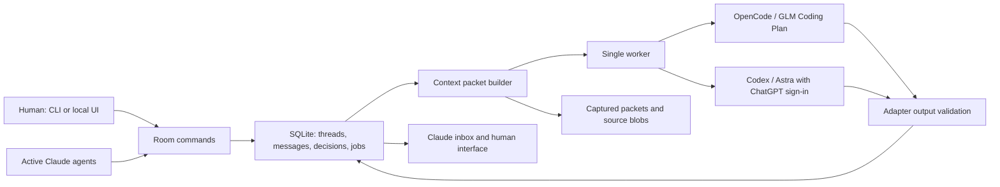

> Archived design from 2026-09-07, before the implementation, Mac-only scope and standalone repository decision. Read `README.md` and `implementation-status.md` for current behavior and support. The historical proposal below is not an execution allowance.

# Persistent Agent Room -- implementation design

**Date:** 2026-09-07  
**Status:** Proposed implementation design; no room implementation or model calls were made to produce this document.  
**Repository baseline:** `5b498c8fed6443a95c46d6476d274bc9c0cab0b8`, toolkit `0.2.0`.  
**Owner/operator:** Brandon, the sole human operator and approver.  
**Initial platforms:** macOS development; Linux verification.  
**Suggested delivery:** a usable CLI pilot first, followed by a small local chat interface and two workflow triggers.

## 1. Decision and intended outcome

Build a persistent, local conversation room for the human operator, active Claude agents, GLM through OpenCode, and Astra through Codex. The room owns messages, source references, current decisions, and pending invitations. Existing authenticated coding clients perform model inference using the operator's plans.

A developer should be able to ask another model a focused question while working, receive a response in the same durable thread, challenge it, and preserve the resulting decision for later sessions. The operator should be able to start an informal design conversation without opening a formal review task.

The first release uses **a fresh consultant session for every model invocation**. Each invocation receives a bounded brief plus selected evidence. This is a deliberate simplification of the earlier possibility of short session reuse: it makes context assembly reproducible and avoids inheriting an unknown conversation history. Provider session IDs are diagnostic references, not the room's memory.

The smallest valuable demonstration is:

1. An active Claude developer posts a question about an API contract.
2. The operator or coordinator invites GLM and Astra.
3. Each receives the same question, relevant constraints, and selected source material.
4. Their responses appear under their own identities.
5. One bounded follow-up exchange resolves a specific disagreement or proposes an experiment.
6. A later fresh session retrieves the decision and its rationale without reading the full room history.

This supports better engineering conversations. It does not establish release readiness, grant human approval, or replace behavioral tests.

### 1.1 Requirements carried forward from the conversation

| ID | Requirement |
|---|---|
| U1 | Use GLM through the existing OpenCode Coding Plan integration. |
| U2 | Use Astra through the existing ChatGPT/Codex plan; OpenCode is an acceptable later alternative if its authenticated integration exposes Astra. |
| U3 | Do not silently fall back to separately billed general API access or another model. |
| U4 | Keep conversations available across agent sessions and process restarts. |
| U5 | Allow human questions, agent observations, and real follow-up discussion. |
| U6 | Bound what each model reads; avoid an ever-growing shared prompt and repeated full-history reads. |
| U7 | Preserve important constraints, dissent, and evidence when condensing a thread. |
| U8 | Fit the current single-operator toolkit and be practical to implement soon. |
| U9 | Treat agents as cooperative but capable of omissions, stale assumptions, and malformed output. |
| U10 | Keep existing human-only approval and disposition boundaries. |

### 1.2 Decisions made in this design

| Area | Choice | Reason |
|---|---|---|
| Storage | Local SQLite plus files for captured packets and source blobs | Transactions, durable messages, and inexpensive retrieval without a hosted service. |
| Runtime | Node 24.20.0 initial verification target; ESM `.mjs` and built-in modules | Reuses the toolkit's Node baseline; avoids a consumer package installation or native npm addon. |
| Database binding | `node:sqlite` behind a small storage module | Available in Node 24; isolate its release-candidate API behind tests. |
| GLM adapter | OpenCode, explicit `zai-coding-plan` provider | Uses the existing plan integration. |
| Astra adapter | Codex with saved ChatGPT authentication, explicit `gpt-6-astra` | Directly supported CLI and authentication route. |
| Claude participation | Active agents use the room CLI and an inbox | Reuses the existing foreground coordinator and subagents. |
| Context | Fresh session for each consultant turn | No hidden accumulation or dependency on provider compaction. |
| Routing | Deterministic rules and explicit invitations | No model call merely to decide whether to make a model call. |
| Execution | One consultant process at a time across the local room store | Simple quota accounting and predictable resource use for the initial pilot. |
| Formal reviews | Remain in the existing review pipeline | Room discussion is advisory and independently recorded. |
| Interface | CLI first; thin local browser interface next | Makes the core usable before adding UI work. |

The built-in SQLite module is documented as a release candidate from Node 24.15.0. The implementation must pin and test its supported Node patch; adding Node 26 support is a separate compatibility result. A small wrapper around SQL operations limits future binding changes. [Node 24 SQLite documentation](https://nodejs.org/download/release/latest-v24.x/docs/api/sqlite.html)

## 2. Scope and delivery boundaries

### 2.1 CLI pilot

Include project registration, threads, messages, invitations, explicit source attachments, search, current constraints/decisions, context packet preview, two consultant adapters, a foreground worker, cancellation, recovery reporting, and export.

Active Claude agents can post and read using Bash calls to the CLI. Inactive Claude sessions are represented by pending inbox items; the MVP does not promise to wake or resume a closed Claude session. GLM and Astra can be invoked by the worker once the operator enables their usage budget.

The CLI pilot must already demonstrate a complete multi-model discussion. It is not complete merely because messages can be stored.

### 2.2 Daily-use release

Add a local browser interface, optional bounded follow-up routing, and advisory integration for reviewer disagreement and stuck work. Provide an operator-controlled pilot budget and a short usage report.

### 2.3 Deferred

Defer provider session reuse, an autonomous background Claude adapter, MCP packaging, remote hosting, multiple human accounts, semantic/vector search, automatic policy rewriting, model-based routing, cross-project memory sharing, and integration with Slack or other external messaging.

No microservice deployment, cloud database, queue service, or new authentication service is needed. The local job table is the work queue.

## 3. Existing implementation and integration points

These are source observations at the baseline revision, not claims that the proposed room exists.

| Existing component | What it provides | Room integration |
|---|---|---|
| [review-session.ts](../../.claude/scripts/review-session.ts#L14) | OpenCode invocation, scoped diff input, consumed artifacts, saved model output | Use its invocation experience and artifacts. Keep the room adapter separate from its verdict parser. |
| [OpenAI adjudication node](../../.claude/scripts/review-session.ts#L66) | A third-vendor response to two reviewers' artifacts; currently pinned to `openai/gpt-5.5` | Attach the artifacts to a room thread. The new Astra participant gets its own explicit configuration. |
| [build-story disagreement path](../../.claude/commands/build-story.md#L425) | Coordinator identifies an explicit review disagreement | Emit one idempotent advisory room event with both artifact references. |
| [build-story recovery](../../.claude/commands/build-story.md#L714) | Resume/repair/escalation procedure | Optionally ask the room for a new hypothesis after repeated failure. |
| [context-usage.sh](../../.claude/scripts/context-usage.sh#L1) | Claude transcript-derived usage, including a documented one-turn lag | Keep for active Claude sessions. Do not use its default million-token denominator for other providers. |
| [workflow map](../../.claude/docs/workflow-map.md#L1) | Canonical application stages and human boundaries | Room outcomes link back to these stages; they do not advance them. |
| [retro command](../../.claude/commands/retro.md#L1) | Keep/tune/cut review of workflow contribution | Add a room contribution summary once the pilot produces useful data. |
| [sync-toolkit.sh](../../tools/sync-toolkit.sh#L199) | Copies toolkit-owned files to consumers | Distribute the thin toolkit integration and example configuration. Install the room core as its own versioned package; runtime history and active configuration stay outside the sync tree. |

The second assessment found real consumer review contributions and recommended small repairs proportionate to the single-operator threat model. This design follows that scope. It does not require repairing every audit finding before an advisory room can be piloted. [Second-pass assessment](second-pass-consumer-trace-2026-09-06.md)

## 4. Architecture and ownership



### 4.1 Local modules

- **Command layer:** validates requests, resolves project/actor, applies policy, and returns JSON.
- **Storage layer:** short SQL transactions, schema migrations, integrity checks, backup/export.
- **Context builder:** deterministic selection, byte budgets, references, snapshot identity, packet manifest.
- **Adapters:** launch an authenticated client, collect native events, normalize output/errors/usage.
- **Worker:** claims one job, checks policy and freshness, runs the adapter, persists its result.
- **Router:** creates invitations from allowed events; never broadcasts every message to every model.
- **Interface:** renders the same records and calls the same commands as the CLI.

CLI commands open the database directly for short operations. `room serve` adds the local interface and may host the worker loop. `room work --once` supports a foreground CLI-only pilot. An atomic worker claim prevents two processes from launching consultants concurrently.

### 4.2 State location

Use `AGENT_ROOM_STATE_DIR` when set; otherwise use `XDG_STATE_HOME/agent-room` when configured, falling back to `~/.local/state/agent-room`. Resolve these in code without changing the process's home variables.

Proposed layout:

```text
<state-root>/
  room.sqlite
  operator-policy.json
  projects/<project-id>/config.json
  projects/<project-id>/blobs/<sha256>
  projects/<project-id>/jobs/<job-id>/
    packet.json
    packet.md
    output.json
    native-events.jsonl
  backups/
```

The schema belongs to the room, independent of the task store. Project registration assigns a UUID and records a canonical repository path. Moving a repository requires an explicit path update; a matching directory name does not merge histories.

All reads, searches, attachments, and jobs are scoped to a project ID. Worktrees may share a project only through explicit registration; source snapshots still identify the worktree and revision.

Runtime state and active configuration must not be placed under synced `.claude/**`. No task-store scan, private agent-memory scan, or whole-home-directory import is part of initialization.

## 5. Interaction model and triggers

### 5.1 Participants

A participant is a stable role identity plus a particular runtime binding. Examples: `human:brandon`, `claude:developer:<run-id>`, `glm:consultant`, `astra:consultant`.

Record the role, provider, requested model, and observed model when the client reports it. An alias is not proof of model identity. For an active Claude agent, model identity may be supplied by its harness or recorded as unverified; never fabricate it.

A model change creates a new participant configuration version. Old messages retain the identity that produced them.

### 5.2 Posting and invitations

Posting and invoking are separate operations:

- `post` stores a message and optionally creates an inbox notification.
- `ask` stores a question and creates explicit consultant jobs under the operator's budget.
- Reading, searching, opening the UI, and polling for updates never invoke a model.
- A literal `@name` inside quoted text or a code block does not create a job.
- The UI's mention action and CLI `--to` resolve a known participant ID.
- A participant may abstain without being treated as failed or unhelpful.

Default agent instruction:

> Open or join a thread when another participant could materially improve your next decision, or when something you learned could change theirs. State the observation, why it matters, and a question or suggestion. Link evidence when available. Continue independent work when the conversation is advisory. You do not need to post when you have nothing useful to add.

### 5.3 Trigger policy

| Trigger | Detection | Recipients | Initial policy |
|---|---|---|---|
| Human question or direct invitation | Explicit `ask` request | Named consultants | Enabled after operator budget activation |
| Agent design question or observation | Agent explicitly opens/posts a thread | Inbox recipients; consultant calls require `ask` | Enabled |
| Reviewer disagreement | Coordinator emits event naming the disputed claim and two artifacts | GLM and Astra, or configured pair | First automated integration |
| Stuck work | Coordinator reports same failure signature after two distinct attempted fixes, with attempts attached | One fresh consultant initially | Second automated integration |
| Changed assumption or contract | Agent posts impact and affected task IDs | Relevant active agents | Inbox only initially |
| Reusable pattern or improvement idea | Agent posts an observation | Room subscribers | No automatic consultant call |
| Retrospective | Human/coordinator requests a bounded thread | Named participants | Manual |
| New message from a model | Validated explicit follow-up request, if enabled | Existing thread participant only | At most one further round |

Do not infer stuck work from elapsed time alone. Do not start an expensive conversation for every failing test, file edit, stage transition, or session start.

The first live pilot uses manual invitations. Enable disagreement and stuck-work triggers individually after their offline fixtures pass.

### 5.4 Bounded conversations

Start with at most two consultant recipients. Each may produce at most two substantive answers in an automatically routed discussion. Limit the entire thread to six launched consultant invocations until the operator extends its budget; context-request follow-ups count toward that limit.

An answer may propose one focused follow-up question to an already invited participant. The router checks the participant, remaining rounds, causal ID, and duplicate-question hash. It may schedule a second round only when the feature is enabled. A new statement of agreement does not trigger anything.

This is a bounded routing rule, not a claim that novelty can be proven from a string hash. The operator can continue a valuable discussion manually.

Thread outcomes are `open`, `waiting_for_input`, `resolved`, or `archived`. Resolution requires a recorded conclusion: a proposed/accepted decision, a specific experiment, or a documented decision to stop. Consensus is not required.

### 5.5 Independent analysis versus open brainstorming

A brainstorming thread can expose all selected prior replies. For a question requesting independent assessments, create both first-round packets from the same captured message boundary and source snapshot, excluding each other's first answer. Show both answers in the next round.

Do not retroactively label a consultant independent if it already consumed the other review. Preserve the packet manifest so this distinction is inspectable.

## 6. Data contract

Use UUIDs, UTC timestamps, explicit schema versions, parameterized SQL, foreign keys, and CHECK constraints. Message order comes from a monotonic database sequence, not timestamps. Commands use an idempotency key for writes that may be retried.

### 6.1 Tables and required fields

| Table | Required data and behavior |
|---|---|
| `projects` | ID, canonical repository path, label, configuration version. |
| `participants` | Project, identity, role, adapter kind, config version, enabled flag. Provider credential values are never stored here. |
| `actor_sessions` | Local actor identity, capability hash, operator/agent scope, creation/expiry times. Raw capabilities never enter model packets. |
| `threads` | Project, title, topic/task IDs, current question message ID, latest human message ID, mode, status, context version, creation/update times. |
| `messages` | Sequence, UUID, project/thread, author, kind, body, reply-to ID, job ID if generated, basis context version, timestamps. Original body is immutable; corrections are new messages. |
| `message_refs` | Message-to-source or message-to-message links, with project-scoped referential integrity. |
| `sources` | ID, project, kind, original locator, captured revision/path, blob hash, size, capture time, sensitivity policy result. |
| `decisions` | Stable decision ID, version, project/thread, statement, status, rationale, source-message IDs, superseded version, actor. Versions append; current version is derived. |
| `constraints` | Stable ID/version, scope, exact text, human source message, status and supersession. Never replaced by an inferred summary. |
| `jobs` | ID, unique causal key, project/thread/participant, status, captured context version, packet hash, configuration hash, requested model, timestamps, error class, reply ID. |
| `job_events` | Job transition, worker identity, timestamp and bounded diagnostic metadata. No raw credentials or environment dumps. |
| `read_cursors` | Project/thread/participant, last explicitly acknowledged message sequence. A cursor is not proof of comprehension. |
| `worker_claim` | Singleton active claim, job ID, owner PID/start identity, heartbeat, lease state. |
| `budget_ledger` | Operator-approved allowance, reserved/started calls, reset boundary and policy version. |

Indexes: messages by project/thread/sequence; sources by project and hash; decisions by project/stable ID/version; jobs by status/created time; unique job causal key; unique generated reply per job. All lookup paths include project scope.

The first migration must encode legal enums and uniqueness, not leave them to prompts. SQL JSON fields must be validated by application schemas before storage.

### 6.2 Message envelope

Illustrative IDs below are shortened for readability; the implementation uses UUIDs.

```json
{
  "schema_version": 1,
  "id": "msg-42",
  "project_id": "project-1",
  "thread_id": "thread-7",
  "author_id": "claude:developer:run-12",
  "kind": "question",
  "body": "Should an absent upstream response be treated as an empty list?",
  "reply_to": null,
  "source_ids": ["source-contract", "source-current-adapter"],
  "task_ids": ["OPS-115"],
  "basis_context_version": 3,
  "idempotency_key": "run-12:contract-question:1"
}
```

The service assigns message ID, sequence, creation time, and authenticated/local actor envelope. Client payloads cannot claim a different author through the normal command/API path.

Human actions and agent actions use separate registered actor sessions. This prevents accidental role confusion at the interface. It is not a security boundary against a malicious process running as the same OS user; that is outside the stated threat model.

### 6.3 Consultant response

Require one JSON object in the final assistant text. OpenCode parsing must not search arbitrary tool logs for a plausible final verdict. The Codex adapter may additionally use `--output-schema`.

```json
{
  "schema_version": 1,
  "kind": "answer",
  "body": "An absent or malformed response should follow the error contract.",
  "citations": ["source-contract", "msg-42"],
  "context_requests": [],
  "proposed_decision": {
    "statement": "Use an empty list only for a valid response containing no records.",
    "rationale": "This preserves the distinction between no data and an invalid response.",
    "citations": ["source-contract"]
  },
  "follow_up": null
}
```

Model-emitted `kind` is `answer`, `needs_context`, or `abstain`. Runtime failures are assigned by the adapter, not by model opinion.

Validation must enforce allowed fields, string sizes, enum values, citation existence within the project and inclusion in the delivered packet/retrieval record, and consistency: `needs_context` requires at least one context request; an abstention cannot contain an accepted decision; all decisions from consultants remain proposals. A normal answer may have no citations when it is clearly a design suggestion, not an assertion of inspected evidence.

A context request names up to three source IDs or a bounded project/thread search query. It never contains a shell command, arbitrary URL to fetch, or unrestricted filesystem path.

The non-null `follow_up` shape is `{participant_id, question, citations}`. The participant must already belong to this discussion and the question must be nonempty. A context request is `{kind: "read", source_id, offset_bytes, max_bytes}` or `{kind: "search", query, limit}`. The service clamps retrieval to policy limits and validates UTF-8 excerpt boundaries. Replies do not directly execute these requests; the broker records and evaluates them first.

## 7. Context management

### 7.1 Three distinct records

1. **Archive:** immutable messages and captured source material.
2. **Thread state:** current question, exact active constraints, current decisions, unresolved objections, known unknowns, and reference IDs.
3. **Invocation packet:** the bounded subset actually sent to one consultant.

The thread state is assembled from authoritative records and selected messages. It is not a free-running summary that may silently replace those records. A prose synopsis is optional, advisory, and always subordinate to the latest question, constraints, and decision versions.

Provider context windows are independent. A new room turn must not use `--continue`, `--last`, or a resume/session flag in the initial release.

### 7.2 Packet assembly order

Given a project, thread, participant, and captured context version:

1. Load the current direct question, every human message since that question, and active operator constraints for this scope.
2. Load current relevant decisions, including rejected/superseded alternatives when the question revisits them.
3. Include unresolved objections and explicit unknowns; do not turn disagreement into agreement.
4. Include the message being answered and its immediate causal chain.
5. Include up to six relevant recent messages, subject to the remaining byte budget.
6. Include explicitly attached source excerpts and results of bounded retrieval.
7. Add participant role, requested response schema, source identity, and the packet's coverage limits.
8. Save the exact packet and manifest before launching a client.

Required material is the current question, subsequent human messages, active constraints, the disputed claim and both sides when adjudicating, and sources explicitly designated necessary to answer. If required material cannot fit, return `needs_scoping` before any model call. Never slice the tail and proceed as though the full input was inspected.

After thread creation, only a human `ask` or human “Make this the current question” action changes the current question pointer. Agent questions and automatically routed follow-ups do not move that boundary. Earlier human constraints remain pinned until explicitly superseded. When a long thread needs a new question boundary, the operator can establish it with the relevant constraints retained; a summarizer cannot make that choice implicitly.

Optional omissions are listed by source/message ID and reason. The consultant may request them.

### 7.3 Budgets and measurements

Use byte caps as the deterministic launch guard in v0.1. Token estimates help display and planning, but are not an exact tokenizer for every client/model.

| Limit | Starting setting | Meaning |
|---|---:|---|
| Brief target | 8 KiB | Roughly a few thousand tokens for typical English; estimate only |
| Full room-supplied packet | 32 KiB maximum | Includes brief, conversation and evidence supplied by the room |
| Recent messages | Up to 6 | Count limit plus byte limit; not the last six blindly |
| Single context retrieval | 8 KiB maximum | Bounded excerpt, with an explicit continuation reference |
| Returned body | 4,000 Unicode characters | Keeps ordinary contributions concise |
| Native event capture | 2 MiB per invocation | Stop and record an output-limit failure if exceeded |
| Consultant wall time | 10 minutes | Includes startup and inference |
| Automatic invocation budget | 6 per thread | Includes context-request and failed launched attempts |
| Simultaneous consultant processes | 1 globally | Applies across registered projects |

The previous 2,000-4,000-token brief and 8,000-16,000-token discussion ranges were conceptual starting points. These byte settings make an enforceable first implementation without claiming that characters or bytes equal tokens.

Measure room packet bytes, estimated tokens with estimator version, native input/output/cache usage when reported, total invocations, and elapsed time separately. A client's cumulative session-token counter must not be presented as its current input context. Unknown usage is `null` with a reason, never zero.

CLI instructions and tool definitions may add context beyond the room packet. A 32 KiB packet therefore is **not** a promise about total model context size. Record the adapter's controlled configuration and any known overhead. New unsupported event formats or unavailable context telemetry must be visible.

Before increasing budgets, prefer narrowing the question or creating a dedicated investigation thread. A larger permitted packet needs an explicit operator policy change, a visible reason, and enough model/client capacity. Do not choose the operating budget from a provider's advertised maximum context window alone.

### 7.4 Retrieval without reading everything

Start with exact IDs, task/topic tags, referenced files, and project-scoped SQLite full-text search. Rank explicit references first, then current decisions, then relevant recent messages, then older matching messages. Resolve ties deterministically.

Return at most five search hits with small snippets and IDs. Reading a hit is a separate bounded retrieval. If FTS5 is unavailable in the verified runtime, `doctor` must report it; exact-reference operations still work, but searchable-room readiness fails until a supported fallback is tested.

No embedding service, background summarizer, or model call is required for search. A consultant that needs an old rationale returns `needs_context`. The broker retrieves the original messages and creates a fresh follow-up packet, charged as another invocation.

On missing or ambiguous evidence, surface the uncertainty. Retrieval is not guaranteed to find every relevant message, so the interface always lets the operator pin an omitted source directly.

### 7.5 Source identity and freshness

Capture each attached source as bytes with a SHA-256 hash. For code, record repository HEAD and path. When discussing uncommitted work, explicitly record `working_tree_included: true` and hashes of the selected files. Never describe HEAD alone as the identity of dirty source.

Source capture accepts explicitly selected files under the registered project, not directory-wide ingestion. Resolve real paths and reject traversal or symlinks escaping the project. Default exclusions include `.env*`, private-key files, credential files, `secrets/`, `agent-memory/` and fixtures explicitly marked sensitive. Capturing `.claude/reviews/` and `.claude/evidence/` is allowed only through explicit selection and those exclusions. The denylist prevents known accidental inclusions; it is not proof that arbitrary source code contains no sensitive data.

Limit a captured text blob to 1 MiB by default; larger inputs need a selected excerpt or a separate investigation. Store the full selected blob when permitted, then deliver bounded excerpts. An explicit committed revision is immutable; `--working-tree` sources are rechecked against the recorded selected-file hashes. Remote URLs are references only until the operator supplies a captured document; the room does not automatically fetch them.

The packet identifies only the scope it contains. It is not a hash of a complete application unless the application was actually captured.

Increment `thread.context_version` on every new human message in the thread, when a decision is accepted or superseded, and when attached authoritative evidence is replaced. This conservative rule avoids needing a model to decide whether a human message was an important correction. Normal peer replies advance the message sequence without automatically invalidating an independent first-round job.

Before starting a queued job, rebuild it if its context version or relevant source hashes changed. If the change occurs while a model runs, preserve its reply with `stale_context: true` and show why. Do not automatically promote that reply into current decisions or an active agent's handoff. A fresh follow-up must include the change; it uses the remaining budget.

A late human message must never be overwritten by an old synopsis. Human corrections remain directly addressable records in every applicable packet.

### 7.6 Preventing summary drift

- Preserve the exact current instruction and constraints.
- Keep decision status and supersession as structured data.
- Keep rationale and original references.
- Keep unresolved objections visible.
- Require source retrieval before claiming a historical fact the packet does not establish.
- Do not recursively compress a summary and discard the originals.
- Do not automatically turn repeated model assertions into facts.
- Show what the consultant received through a “View context” action.

Future session reuse is eligible only after measurements demonstrate a meaningful benefit. It must bind a native session to one project/thread/participant/configuration, measure actual growth, cap continuation count, and start fresh on material changes. An existing session's small new message does not imply a small total context.

## 8. Plan-authenticated adapters

### 8.1 Common contract

```typescript
interface ConsultantAdapter {
  inspectLocalCapabilities(): Promise<CapabilityReport>;
  prepare(packet: Packet, policy: OperatorPolicy): PreparedInvocation;
  run(invocation: PreparedInvocation, signal: AbortSignal): AsyncIterable<NativeEvent>;
  normalize(events: NativeEvent[]): NormalizedResult;
}
```

`prepare` returns an executable path, argument array, controlled working directory, and environment policy. Use `spawn` with `shell: false`. Never interpolate a room message into a shell command.

Store client version, adapter version, requested model, observed model if supplied, authentication mode classification, configuration hash, packet hash, start/end time, and native session ID if available. Keep credentials in the coding client's own authentication store; the room does not copy tokens into SQLite, packets, or logs.

Run consultants in a per-job working directory outside the consumer checkout. They receive selected content through stdin/packet files. They do not inherit the entire application's working conversation or acquire responsibility for editing the application.

Native event formats are version-sensitive. Ship fixture-based parsers for explicitly tested client versions. Unknown terminal/error events, a missing final response, or a malformed model response are errors even when the process exits zero.

### 8.2 GLM through OpenCode

Use the configured `zai-coding-plan/<verified-model-id>` provider. The existing runner requests `zai-coding-plan/glm-5.3`; verify that model in the operator's current client rather than silently replacing it.

Illustrative invocation contract:

```text
opencode run --model zai-coding-plan/<verified-model-id>
             --agent room-consultant --format json
```

Send the packet through stdin. Do not pass `--continue` or `--session`. Capture the final assistant text from native JSON events, separately from tool/debug output.

Create a room-owned OpenCode agent/configuration for this isolated invocation, leaving the consumer's `opencode.json` unchanged. Deny editing, Bash, spawning tasks, web access, and other unneeded tools; evidence requests go through the response contract. Verify configuration precedence and effective permissions with fixtures and the live adapter smoke test. OpenCode documents per-agent permissions; the old `tools` configuration is deprecated. [OpenCode agent permissions](https://opencode.ai/docs/agents/#permissions)

Z.AI documents a separate Coding Plan provider in OpenCode. The room uses that client integration for the operator's project work, rather than treating the plan as a general API credential. [Z.AI OpenCode integration](https://docs.z.ai/devpack/tool/opencode)

### 8.3 Astra through Codex

Require saved **ChatGPT authentication**, explicit `gpt-6-astra`, and the verified CLI version. Check the authentication mode through a supported local status interface without printing credential contents. A stored API-key login is not sufficient for the user's plan-only requirement.

Illustrative invocation contract, to be finalized by the capability test:

```text
codex exec --model gpt-6-astra --sandbox read-only
           --skip-git-repo-check --ephemeral --json
           --output-schema <room-response-schema> -
```

Use an isolated job directory and the supported configuration controls to disable unrelated integrations, plugins, web search, and unneeded tools. The installed CLI exposes `--ignore-user-config` while retaining authentication; validate that behavior in the adapter compatibility fixture before relying on it. Do not modify the operator's global configuration to run a room turn.

Remove API-key/provider-override environment variables from the child environment where they could change this authentication path. Preserve the variables required for the client's saved login. The preparation log records variable names and decisions, not secret values.

Codex documents reuse of saved authentication for `exec`, subscription access through ChatGPT sign-in, and Astra as a selectable CLI model. Account availability still depends on plan/client/rollout and must be verified for this installation. [Codex non-interactive mode](https://learn.chatgpt.com/docs/non-interactive-mode), [authentication](https://learn.chatgpt.com/docs/auth), [models](https://learn.chatgpt.com/docs/models)

A read-only filesystem sandbox does not by itself disable all reads, tools, or external integrations. “Answer from this packet” is a cooperation instruction, not a security boundary. The adapter must inspect effective capabilities, disable unnecessary integrations, and treat unexpected tool activity as a nonconforming consultation. Rejecting its reply cannot undo a tool call that already occurred. Any capability that remains available must be disclosed in `doctor` and covered by the one-operator threat model; do not claim complete tool isolation without a demonstrated runtime boundary.

### 8.4 OpenCode for Astra and Claude automation

OpenCode documents ChatGPT Plus/Pro authentication. An Astra-through-OpenCode adapter is optional after the Codex path works; it needs its own model availability, authentication, permission, and output-format checks. It is not an automatic fallback. [OpenCode OpenAI provider](https://opencode.ai/docs/providers/#openai)

Active Claude agents use room commands within their existing session. The worker does not launch a Claude SDK/API session behind the operator's back. A future headless Claude adapter must use an explicitly selected supported client and account route, with the same budget and context tests.

### 8.5 Authentication and quota states

Normalize at least: `auth_required`, `wrong_auth_mode`, `model_unavailable`, `quota_wait`, `client_unsupported`, `permission_config_error`, `context_too_large`, `invalid_output`, `timeout`, `cancelled`, `interrupted_unknown`, and `provider_error`.

Do not infer a quota-reset timestamp unless the client reports one. A rate-limit or quota wait does not automatically cause rapid retries, reauthentication, a provider switch, or model downgrade.

## 9. Jobs, recovery, and usage policy

### 9.1 Job lifecycle

```text
queued -> preparing -> running -> succeeded
                       running -> failed | cancelled | interrupted_unknown
queued/preparing -> needs_scoping | auth_required | quota_wait | disabled
queued -> cancelled
```

`succeeded` means a valid room reply was recorded. It does not mean a proposed implementation is correct, a review passed, or a task is complete.

In one transaction, reserve a budget slot, acquire the singleton worker claim, and mark the job preparing. Save and verify the packet before starting the client. Mark the invocation started before/at spawn using a durable event. Never hold a database transaction open while waiting for inference.

On completion, atomically insert the validated reply, link it to its job, record the final state, and release the claim. A unique reply-per-job constraint makes result ingestion idempotent.

A caller retrying `ask` with the same idempotency key receives the existing job IDs. A deliberate retry after an uncertain provider run creates a new job linked to the original; it is not silently deduplicated as though nothing happened.

### 9.2 Interrupted execution

The worker records PID/start identity and a heartbeat. Recovery distinguishes a live worker, a confirmed stopped process, and unknown execution state. A stale heartbeat alone is not permission to start a duplicate model call.

After process loss, preserve the job as `interrupted_unknown` unless a durable terminal result can be recovered. Do not automatically retry: a request may already have consumed quota. The UI offers inspect, cancel/reconcile, or explicit retry.

Cancellation signals the child process group, waits up to five seconds, then terminates remaining local children if necessary. It records the attempt; cancellation cannot promise that a provider stopped inference or refunded usage.

Restore/restart never discards messages, pending human questions, or unresolved objections.

### 9.3 Operator policy

Model execution is disabled by default. The operator enables selected adapters with a bounded allowance for a pilot or work session. This is one authorization of an operating envelope, not a prompt before every already-authorized turn.

Suggested initial policy:

```json
{
  "schema_version": 1,
  "execution_enabled": false,
  "allowed_adapters": ["opencode-glm-plan", "codex-chatgpt-astra"],
  "allow_general_api_fallback": false,
  "max_global_concurrency": 1,
  "max_calls_per_thread": 6,
  "max_calls_per_day": 20,
  "reset_timezone": "UTC",
  "max_calls_per_participant_round": 1,
  "automatic_follow_up_rounds": 1,
  "max_packet_bytes": 32768,
  "timeout_seconds": 600,
  "enabled_triggers": ["manual"]
}
```

Specify the reset timezone in the saved policy; default UTC. Reserve limits atomically so parallel `ask` requests cannot overbook them. An invocation that started counts even if it failed. A proven pre-spawn validation failure releases the reservation.

These are conservative pilot settings, not a model-provider pricing model. Display native quota information only when available and distinguish unknown remaining quota from unlimited usage.

The model-facing command surface cannot enable execution, enlarge budgets, change providers, or accept human decisions. The human operator can update the policy deliberately.

## 10. CLI and local interface

### 10.1 Proposed CLI

`room` below means the shipped `.claude/scripts/room.sh` wrapper. These are proposed commands, not commands available at this revision.

| Command | Purpose |
|---|---|
| `room init --project <path>` | Register project and create local room state; no model call |
| `room doctor --project <id> --offline` | Check runtime, schema, paths, CLI flags, and local auth classification without inference |
| `room policy show / enable / pause` | Operator-only inspection/activation/pause of consultant execution; limit changes require the operator scope |
| `room actor attach --project <id> --role <role> --run-id <id>` | Operator-authorized registration of an active agent identity and scoped local client capability |
| `room thread open --project <id> --title <text> --task <id>` | Start a discussion |
| `room post --thread <id> --body-file <path> --reply-to <id>` | Append text; supports `--body-stdin` |
| `room source add --thread <id> --path <relative-path> --revision <sha>` | Capture an explicit source; dirty-file mode must be explicit |
| `room ask --thread <id> --to glm,astra --body-file <path> --key <id>` | Store a question and queue invitations |
| `room inbox --project <id> --actor <id>` | Read pending questions without marking them acknowledged |
| `room ack --thread <id> --through <sequence>` | Advance a participant's read cursor |
| `room read --thread <id> --after <sequence> --limit <n>` | Bounded message page |
| `room search --project <id> --query <text> --limit 5` | Bounded snippets with source IDs |
| `room context preview --thread <id> --for astra` | Show/save the exact proposed packet and omissions; no model call |
| `room work --once` | Run at most one eligible queued job under enabled policy |
| `room jobs --project <id>` | Show queued/running/error states and usage |
| `room cancel --job <id>` | Cancel a queued/running invitation |
| `room retry --job <id>` | Explicitly create a linked retry under budget |
| `room recover --job <id> --inspect` | Inspect an interrupted claim; an operator may reconcile it after confirming the original process is stopped |
| `room decision propose / accept / supersede` | Separate proposals from human decisions |
| `room export --thread <id> --out <path>` | Export readable Markdown plus referenced records |
| `room backup --out <path>` | Consistent database backup plus referenced blob manifest |
| `room serve` | Start the local interface; no browser launch or model enablement implied |

Normal commands support `--json`. Standard output contains one structured result; diagnostics go to standard error. A successful queue operation returns `queued` with job IDs, never an answer-like success message.

Command exit codes: `0` operation succeeded; `2` invalid input; `3` policy/auth/capability unavailable; `4` stale-version conflict; `5` storage/I/O error; `6` consultant execution failed; `7` input requires scoping. Inspecting an old failed job is a successful read with `status: failed` in its result.

### 10.2 Local chat interface

Use a small static interface served by the same Node process, without an application framework for v0.1. It should provide:

- Project/thread list, topic/task filters, unread counts, and search.
- Message list with participant role/model, source links, reply action, and stale-context markers.
- Composer with explicit recipients and a clear “Post” versus “Ask models” action.
- Current constraints, decisions, unresolved questions, and “View context.”
- Queued/running/unavailable status, cancel/retry, and remaining local allowance.
- Operator-only decision acceptance and budget controls.

Poll local state or use server-sent events; neither action invokes a model. Show unknown quota as unknown. Do not display an absent participant as though it is reading or typing.

Bind to `127.0.0.1` with an automatically selected port. Require a locally provisioned session capability for writes, validate Host/Origin, and do not enable cross-origin access. Render messages as text or sanitized Markdown with raw HTML disabled. Never execute scripts or fetch arbitrary attachments merely because a model posted a link.

This local capability separates normal UI and agent actions; it is not intended to resist another malicious process under the same OS account.

## 11. Decisions, evidence, and existing task state

Room decisions have status `proposed`, `accepted`, `rejected`, or `superseded`. Consultants can propose. Only a human operator action accepts/rejects policy choices; an accepted room decision still does not set `accepted-risk` or `false-positive` on task findings.

The MVP does not mutate task status, approval fields, receipts, or finding dispositions. Exported decisions can be linked from a normal task comment by the active coordinator through the existing task CLI. That bridge is explicit and uses the task system's own writer.

Formal review receipts remain produced by the existing check pipeline. A room answer may identify a defect or suggest a fix; the subsequent review/test execution supplies evidence. The room never records a required check as passed merely because two models agreed.

For the reviewer-disagreement integration:

1. Preserve original review artifacts and their source identities.
2. Open/link one thread using a causal key derived from task, finding IDs, attempts and artifact hashes.
3. Attach the disputed claims and relevant code.
4. Ask the configured participants; preserve their initial independence status.
5. Record the room's recommendation and unresolved uncertainty.
6. Let the existing coordinator/human disposition route act on it.
7. Link later implementation or verification evidence back to the thread.

Import only explicitly selected existing artifacts. Do not bulk-ingest old reviews, transcripts or task stores at startup.

## 12. Packaging, adoption, and recovery

### 12.1 Proposed repository files

**Portability revision -- 2026-09-07:** the operator wants the room developed in this repository and reusable across other toolkits, while Claude continues the existing toolkit cleanup. Put the implementation in **`packages/agent-room/`**, with its own package manifest, version, tests and documentation. This supersedes the original proposal to place the core in `.claude/scripts/agent-room/`.

All paths below are future implementation targets. Creating this design does not create or install the package.

```text
packages/agent-room/
  package.json
  README.md
  CHANGELOG.md
  bin/agent-room.mjs
  src/
    cli.mjs
    store.mjs
    schema.mjs
    context.mjs
    sources.mjs
    jobs.mjs
    policy.mjs
    router.mjs
    adapters/codex.mjs
    adapters/opencode.mjs
  web/server.mjs
  web/index.html
  web/app.js
  web/styles.css
  migrations/001-initial.sql
  schemas/consultant-response.json
  prompts/consultant.md
  integrations/
    claude/room.md
    claude/room.sh
    generic/README.md
    generic/event-example.json
  examples/agent-room.example.json
  docs/implementation-status.md
  tests/
    fixtures/
    store.test.mjs
    context.test.mjs
    adapters.test.mjs
    jobs.test.mjs
    portability.test.mjs

# Thin integration added at an agreed toolkit integration boundary:
.claude/scripts/room.sh
.claude/config/agent-room.example.json
.claude/docs/agent-room.md
.claude/commands/room.md
.claude/scripts/tests/agent-room-smoke.sh
```

The package's public boundary is its CLI and versioned JSON message/event contract. Toolkit/task IDs and source references are explicit inputs. The core must not import this toolkit's task CLI, hard-code OPS/UPC identifiers, assume a sibling repository, or require its metadata schema. Claude command/spawn guidance and disagreement/stuck-work mappings belong in the integration layer. Provider adapters remain separate from toolkit integrations: an OpenCode/Codex adapter selects an inference client; a toolkit integration connects a workflow to the room.

Use `node --test` for pure and fixture tests. Keep the initial implementation on built-in modules where practical and run its tests from the package directory without changing the root package/build configuration. The browser interface ships with the package. Integration files copied into consumers still need their applicable lint checks; extensions do not exempt them.

Give the package its own version independently of the parent toolkit's `VERSION`. Other toolkits can use a local checkout during development or an explicitly pinned package archive for adoption. `npm pack` creates a package tarball, and npm supports installation from a local tarball; public registry publication is not required for this route. Verify the package's file allowlist and archive contents before distribution. [npm pack](https://docs.npmjs.com/cli/v11/commands/npm-pack), [npm install](https://docs.npmjs.com/cli/v11/commands/npm-install/)

The current toolkit sync traverses `.claude`; it does not automatically distribute `packages/agent-room/`. Adoption must explicitly install the package and then its thin integration. The wrapper checks the installed version/capabilities and explains missing installation rather than downloading or invoking a model implicitly. Start with one source of truth here; extracting the package into its own repository later remains possible without changing its CLI contract.

Keep database migrations in the shipped code, but databases and operator configuration in external state as specified in section 4.2. Each registered project retains a separate scope; reusing the package does not automatically share conversations between toolkits. Package archives and toolkit sync must exclude runtime databases, captured source blobs, active configuration and credentials. [Sync collection](../../tools/sync-toolkit.sh#L199)

### 12.2 Adoption sequence

1. Build and verify offline in the toolkit.
2. Register implementation tasks in the toolkit tracker when implementation begins; IDs in this design do not claim reserved tracker numbers.
3. Verify a pinned room package archive in a clean disposable consumer, then adopt the package and its thin toolkit integration through the existing upstream process at an idle consumer boundary.
4. Run `doctor --offline` and review the proposed configuration.
5. Initialize one consumer's room without importing unrelated data.
6. Have the operator enable a small consultant budget.
7. Run the explicit live compatibility checks, then the manual discussion pilot.
8. Add the UI and opt into one automatic trigger at a time.

The local example/config format has a version. Unsupported configuration or a newer database schema fails with a migration requirement, not implicit defaults.

### 12.3 Backup and upgrades

Use SQLite's consistent backup facility before a schema migration; do not copy only the main database file while WAL writes are active. Back up referenced blobs with a manifest and verify their hashes.

Apply migrations transactionally with a schema-version guard. Older code refuses a newer schema. A failed migration leaves the prior version usable or provides a verified backup restore path; it never silently starts an empty database at another path.

Do not prune messages or decisions by default. Diagnostic event logs may have explicit retention after normalized results are persisted, but never delete packets or evidence required by a retained decision without marking the resulting gap.

Rollback can disable model execution and leave read/export available. Toolkit rollback and room database rollback are distinct operations. Restore must be tested into a separate state directory before replacing live state.

### 12.4 Development alongside the toolkit cleanup

Develop the room in a separate branch/worktree of this repository so concurrent Git staging and commits do not share an index. The resulting source location in the repository remains `packages/agent-room/`. Keep room implementation, tests, examples and its implementation-status record within that subtree during independent development.

Claude can continue owning the active toolkit tracker, handoff, existing `.claude` commands/scripts, sync script and root version/changelog during cleanup. Record ROOM-01 through ROOM-09 progress in the package-local status document first, then add the canonical tracker pointer and shared integration changes at one coordinated boundary. This postpones shared-file edits; it does not bypass the repository's shipping checks or claim the package is already integrated.

The core, provider fixture tests, worker, CLI and local interface can proceed before the audit repairs finish because room discussion is advisory and its state is independent. The live plan/model checks and the final consumer pilot remain required for completion. Confirm the actual supported client/runtime behavior during implementation; do not call the adapters complete on stubs alone or promise to finish before the other session's unknown workload.

Add a portability acceptance case to A23: pack the module, install/run it in a clean temporary repository without this toolkit's `.claude` tree or sibling consumer, and complete post/read/restart/export operations. Register a second project and prove its search/context stays separate. The final live pilot then exercises the same package through this toolkit's thin integration.

## 13. Implementation work packages

These IDs are local to this design. The implementation can turn them into toolkit T-numbers without editing the original audit reports.

| ID | Deliverable and likely files | Depends on | Completion evidence |
|---|---|---|---|
| ROOM-01 | Contracts, runtime pin, offline capability report; `schema.mjs`, `policy.mjs`, response schema, adapter fixture format | None | JSON/config invalid cases refuse; Node/SQLite capabilities and CLI help contracts tested without inference |
| ROOM-02 | Durable CLI: projects, threads, messages, refs, decisions, migrations and export; `store.mjs`, `cli.mjs` | 01 | Concurrent posts survive; duplicate requests are idempotent; restart/export/restore preserve records |
| ROOM-03 | Source capture, retrieval, packet builder and preview; `sources.mjs`, `context.mjs` | 02 | Golden packet fixtures, byte caps, original-source retrieval, late correction and stale-source tests pass |
| ROOM-04 | GLM and Astra adapters plus strict native-event normalization | 01, 03 | Offline success/error/format/auth fixtures pass; candidate invocation profiles are ready for the live checks in ROOM-06 |
| ROOM-05 | Worker, usage reservations, cancellation and uncertain-run recovery; `jobs.mjs` | 02, 04 | Two workers cannot double-launch; crash/cancel/budget tests pass; no general API fallback |
| ROOM-06 | Manual discussion and active-Claude inbox; `room.md`, documentation | 03, 05 | Operator-authorized live checks verify both plan routes/models, then one complete question -> two responses -> follow-up -> decision -> fresh-session retrieval trace |
| ROOM-07 | Local chat interface using the same command contracts | 06 | Human can post, invite, inspect context, cancel, accept a decision and reopen the thread after restart |
| ROOM-08 | Disagreement/stuck-work events and bounded follow-up routing | 06 | Duplicate-event, quoted-mention, loop, stale-question and quota-limit fixtures; advisory task integration |
| ROOM-09 | Consumer pilot, measurements, upgrade/restore instructions and distribution verification | 07, 08 | Pilot record includes useful/unused contributions, latency, calls, context sizes and all acceptance limits |

**First usable milestone:** ROOM-01 through ROOM-06, including the live manual trace.  
**Daily-use milestone:** add ROOM-07; automatic triggers may remain disabled while gathering experience.  
**Initial supported release:** ROOM-09 complete, with whichever triggers actually passed the pilot.

Do not wait for an elaborate UI, vector search, or provider session optimization to prove the core interaction. Conversely, do not label an offline adapter stub as a working plan integration.

## 14. Verification and acceptance

All automated tests default to temporary `AGENT_ROOM_STATE_DIR` values and fake consultant executables. They must not discover real task stores, use a live database, consume model quota, send external messages, or alter consumer implementation files.

### 14.1 Required offline tests

| ID | Scenario | Required result |
|---|---|---|
| A01 | Twenty concurrent message appends; retry each request ID | Twenty unique complete messages, stable ordering, no duplicates |
| A02 | Project A search/reference attempts to resolve Project B data | No cross-project result; explicit reference error |
| A03 | Restart after posting, decision acceptance, and queue creation | Same messages/decisions/pending jobs remain |
| A04 | A model payload claims human author or accepted decision | Reject or retain only as an agent proposal; no human action occurs |
| A05 | Ten thousand irrelevant messages surround an early relevant decision | Bounded packet, retrieved original decision, irrelevant history excluded |
| A06 | A late human instruction reverses an earlier decision | Latest instruction appears verbatim; prior choice is superseded, not silently retained |
| A07 | Two conflicting claims and an unresolved objection | Packet preserves both claims and uncertainty |
| A08 | Required sources exceed packet budget | `needs_scoping` before launch; no truncated consultation counted as complete |
| A09 | Same question/config/sources assembled twice | Identical packet selection and content hash, excluding separately stored creation metadata |
| A10 | Source file or relevant instruction changes while job is queued/running | Rebuild before launch or mark returned answer stale; no automatic promotion |
| A11 | Provider exits zero without valid final JSON; high-volume tool logs contain JSON | No fabricated answer; terminal-output parser uses the actual final assistant channel |
| A12 | Wrong auth mode, unavailable Astra, or unavailable GLM plan model | No call on an alternate billing route/model; concrete unavailable state |
| A13 | Two workers claim jobs simultaneously | One consultant launch globally |
| A14 | Repeated trigger delivery and duplicate follow-up request | One causal job; round/call limits remain enforced |
| A15 | Provider process lost after launch before result persistence | `interrupted_unknown`; no automatic paid/plan-consuming retry |
| A16 | Budget exhausted during concurrent invitations | Atomic reservation refuses excess calls; existing messages remain readable |
| A17 | Quoted `@astra`, UI polling, opening inbox, exporting | Zero consultant launches |
| A18 | Dangerous or escaping source path, symlink outside allowed project, secret path | Reject source capture; never include it in a packet |
| A19 | CLI emits oversized output, waits for interactive auth, or exceeds timeout | Stop with a bounded diagnostic and non-success state |
| A20 | Malformed DB/config, unsupported future schema, failed migration | Explicit error and preserved prior data; no empty fallback store |
| A21 | Backup while messages are written, then restore to a new directory | Consistent readable records and matching referenced blob hashes |
| A22 | Disable room execution in an existing consumer | Existing task/review workflow still operates; room cannot advance a task |
| A23 | Sync/package fixture | Runtime history, local configuration and credentials are never distributed |
| A24 | Existing active Claude run misses an inbox check | Message remains pending; UI does not claim delivery or comprehension |
| A25 | Independent first-round jobs are executed sequentially | Both packets retain the same initial evidence boundary; second does not see first reply |
| A26 | Unexpected tool activity or changed client event schema | Consultation is marked nonconforming/unsupported; no silent normal reply |
| A27 | Model provides a stale/unknown citation or contradictory response shape | Strict validation refuses output without rewriting it into a valid answer |

Use these as behavior tests, not snapshots that merely repeat implementation choices. Packet snapshot tests must also assert the required facts and exclusions.

### 14.2 Live compatibility checks

Live checks need the operator's enabled usage budget. This design document authorizes no such execution by itself.

For each adapter, record: installed client version, authentication mode without secrets, requested model and any reported resolved identity, configuration hash, packet hash, native completion state, valid final response, observed tool activity, usage availability and elapsed time.

Run one small project-related question and one evidence-request follow-up. Confirm the reply can be mapped into the room and referenced by a later fresh session. Verify the effective permission configuration without destructive probes. If plan routing or actual model availability cannot be established, keep that adapter disabled.

No numerical token/dollar estimate is a substitute for establishing which authentication route the client actually used.

### 14.3 Context-quality pilot

Create a small set of representative questions with operator-reviewed expected constraints and source references. Include old rationale, late corrections, disagreement, missing evidence, and a changed revision.

Compare a fresh room packet with the minimally sufficient source set. Score whether the response:

- Obeys the latest operator constraint.
- Names the relevant decision and evidence.
- Preserves unresolved uncertainty.
- Avoids inventing a historical fact.
- Requests missing context instead of guessing.
- Produces a useful next decision or experiment.

Do not require identical wording or assume one model answer is ground truth. Repeat failures enough to distinguish a brittle packet builder from one variable model result. Real-model comparisons consume the configured pilot allowance.

## 15. Measurement, tradeoffs, and remaining checks

### 15.1 What to measure

Track per thread: invitations, launched calls, abstentions, errors, duration, packet bytes, known native usage, follow-up rounds, stale replies, human interventions, and a human/coordinator-linked outcome.

Useful outcomes are a changed design decision, a substantiated defect, a better test/experiment, reused prior knowledge, or time saved. Link them to their messages and later artifacts. Message volume and model agreement are not success metrics.

After the first 5-10 discussions, decide which triggers to keep. This is a tuning sample, not statistical proof of effectiveness. Compare added waiting and operator attention with useful contributions.

### 15.2 Explicit tradeoffs

| Choice | Benefit | Cost or limitation |
|---|---|---|
| Fresh consultant session per turn | Predictable context and reproducible packet | Repeats brief/setup; may use more quota and lose provider cache benefits |
| Selected packets | Lower reading burden and clearer scope | Retrieval may omit useful material; must expose omissions and support targeted requests |
| One worker | Simple claims, quotas and recovery | Two-model conversations take longer; measure before adding concurrency |
| Local state | Simple deployment and direct operator control | Host availability and backups are the operator's responsibility |
| CLI plan integration | Fits existing subscriptions | CLI versions, auth state, model availability and plan limits can change |
| Advisory room | Can be adopted without replacing task enforcement | Coordinator must explicitly connect conclusions to implementation and verification |
| Structured final envelope | Reliable ingestion and context requests | Formatting failures are possible; do not hide them with guessed repairs |
| Human-reviewed decisions | Preserves operator authority and rationale | Requires a small amount of deliberate curation |
| Node built-in SQLite | No consumer dependency installation | API maturity and runtime compatibility require a pinned verification target |

### 15.3 Checks to settle during ROOM-01/04

These are bounded implementation checks, not reasons to delay writing the core:

1. Exact installed OpenCode/Codex versions and native event fixtures.
2. Current GLM plan model ID; whether Astra is exposed to the operator's Codex login.
3. Effective per-job permission/configuration controls and any remaining tool capabilities.
4. Availability and semantics of usage telemetry for each client.
5. Node 24.20.0 and SQLite FTS5 compatibility on macOS/Linux.
6. Consumer lint and sync behavior for the new package paths.

If a check fails, record the specific unsupported capability and keep the affected adapter or feature disabled. Continue offline core work and the other supported path.

## 16. Document provenance and verification

This design derives from the current repository instructions, workflow commands, review runner, context usage helper, sync implementation, the two saved assessments, and the user's plan-only/context-management requirements.

Provider behavior is supported by the primary documentation linked next to the relevant claim. Proposed commands, schemas, limits, and milestones are design decisions. They were not executed as an implementation.

During design preparation, repository source and CLI help were inspected; official documentation was checked. No model inference, authentication changes, task-store operations, consumer sync, deployment, or implementation edits were performed. The only new repository artifact for this request is this document.

Document checks: all 10 local links (9 unique) resolve to existing files and valid source line numbers; all three JSON examples parse; code fences are balanced; no em dashes are present. The document is not Git-ignored. No implementation files were edited by this request. Separate edits to the tracker and September 2 handoff appeared during drafting and were preserved. The document remains an untracked Markdown artifact alongside the earlier Codex assessments.
